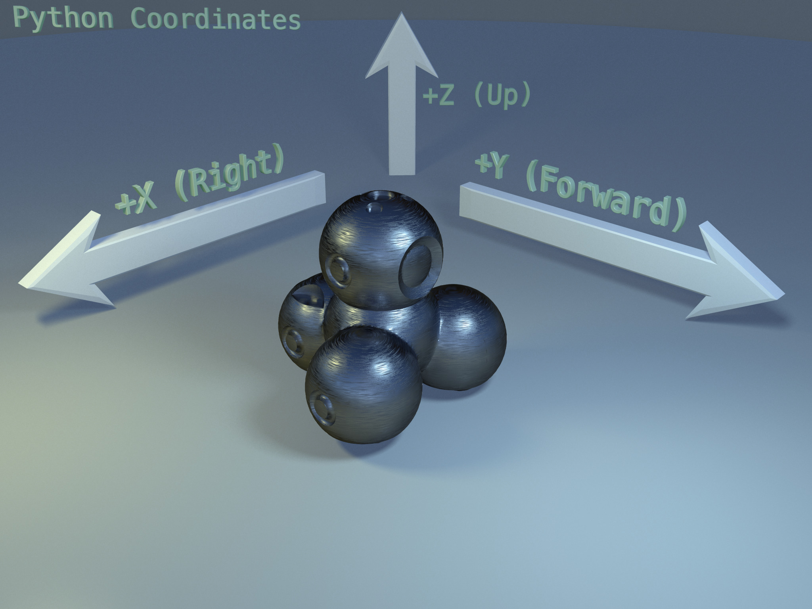
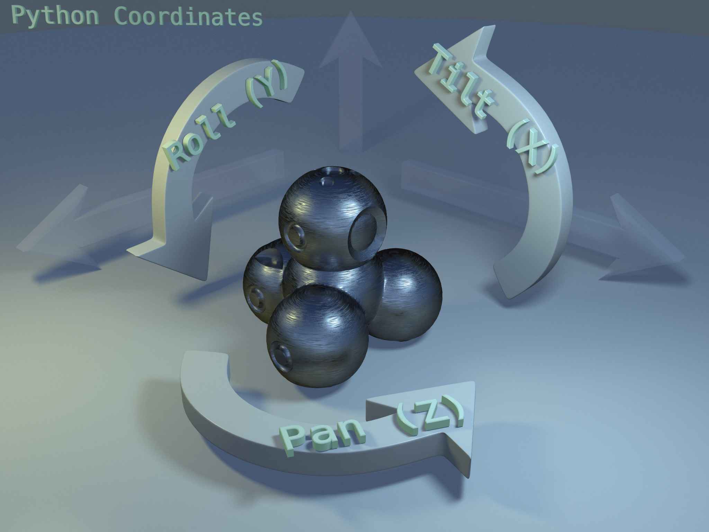

# WonderPy Robot Manual
This document is just in an Alpha stage.

The best way to get started is to look at the ['tutorial examples' here](https://github.com/playi/WonderPyExamples).

This document gives an overview of the structure, commands, and members in the API.

The WonderPy robot API lets you send commands to the robot and also inspect the current state of the robot's sensors.

# Contents
* [Commands](#commands)
  * ["do" vs. "stage"](#do-vs-stage)
  * [eyering](#robotcommandseyering)
  * [head](#robotcommandshead)
  * [media](#robotcommandsmedia)
  * [monoLED](#robotcommandsmonoled)
  * [body](#robotcommandsbody)
  * [RGB](#robotcommandsrgb)
  * [accessory](#robotcommandsaccessory)
* [Sensors](#sensors)
  * [accelerometer](#robotsensorsaccelerometer)
  * [animation](#robotsensorsanimation)
  * [beacon](#robotsensorsbeacon)
  * [button\_1](#robotsensorsbutton_1)
  * [button\_2](#robotsensorsbutton_2)
  * [button\_3](#robotsensorsbutton_3)
  * [button\_main](#robotsensorsbutton_main)
  * [distance\_front\_left\_facing](#robotsensorsdistance_front_left_facing)
  * [distance\_front\_right\_facing](#robotsensorsdistance_front_right_facing)
  * [distance\_front\_rear](#robotsensorsdistance_front_rear)
  * [gyroscope](#robotsensorsgyroscope)
  * [head\_pan](#robotsensorshead_pan)
  * [head\_tilt](#robotsensorshead_tilt)
  * [pose](#robotsensorspose)
  * [speaker](#robotsensorsspeaker)
  * [wheel\_left](#robotsensorswheel_left)
  * [wheel\_right](#robotsensorswheel_right)
* [Coordinate Systems](#coordinate-systems)
* [Units](#units)
* [Share your work !](#share-your-work-)

# Commands
## "do" vs. "stage"
Many commands come in two flavours: the more primitive versions all begin with the word **stage\_**. These versions send the command to the robot and return immediately. In other words, they do not "block" execution.  The other flavour begin with the word **do\_**. These versions send the command and wait for it to finish. In other words, they do block execution. The "Do_" commands should only be used inside some form on concurrent execution such as a thread.  

With the exception of the [Pose commands](#robotcommandsbody) the robot does not maintain any queue of commands: once sent to the robot, a second command which uses the same physical actuators as a previous command will immediately override the previous command.

## robot.commands.eyering
Each robot has a ring of twelve LEDs around the eye, this is called the 'eyering'. The commands in this object let you control the state of each individual LED as well as the overall brightness.

## robot.commands.head
The commands in this object let you turn Dash or Cue's head left and right and up and down.

## robot.commands.media
The commands in this object let you play the sounds which are resident on the robot. The sounds themselves are listed per-robot in [wwMedia.py](../WonderPy/components/wwMedia.py).
### Custom Sounds
At this time the API does not allow you to transfer custom sounds to the robot.  To play custom sounds you'll need to record & transfer them to the robot with another app such as Wonder, Blockly, or Cue, and then you can play them from WonderPy with the sound tokens "CUSTOM\_01" - "CUSTOM\_10".

## robot.commands.monoLED
The commands in this object let you control the LED in the main button on the top of each robot's head.  Note that for Cue this command controls only the red component of the RGB LED in the button.  It can be controlled in full color with robot.commands.RGB.

## robot.commands.body
The commands in here let you drive the robot.  
There is some subtlety to these, so we mention some key aspects.  
As usual, bear in mind that the *do\_* family of commands will block execution until the command completes, while the *stage\_* family send the command and continue execution immediately without waiting for completion.
### robot.comands.body.do_forward(distance, time)
Drive forward the specified distance and then stop.
### robot.comands.body.do_turn(degrees, time)
Turn counter-clockwise the specified degrees and then stop.
### robot.comands.body.do_pose(x, y, degrees, time, mode)
Drive to a 'pose' within the given time and then stop.  
Be sure to understand the [coordinate system](#coordinate-systems).  
A 'Pose' means a position and an orientation for the robot. 
By default this pose will be relative to the robot's current position when the command is issued. This is the most common use-case.  However overall accuracy across multiple pose commands will be improved by specifying the mode in terms of a global coordinate system, which is not relative to the robot's current position.  
The different modes are described in the WWPoseMode class in [wwConstants.py](../WonderPy/core/wwConstants.py).  
The _time_ parameter is always relative to the moment the command is received by the robot.  Even when the "mode" is relative, the time parameter is interpreted this way.
Additionally, the pose command is the only command which the robot enqueues.  The robot maintains a queue of up to ten pose commands.  However, be sure to wait for at least one sensor packet to arrive before sending additional pose commands, otherwise the second one will override the first.  When sending pose commands before the current pose is finished, bear in mind that _time_ parameter is always relative to when the command is received by the robot.  The robot provides a sensor called the "pose watermark" indicating the current depth of the pose queue.  This can be monitored in the robot sensor "pose" as the member "watermark_inferred".  The ideal number of poses in the queue is about five.  
Managing these details of the pose system can be complex, and for that reason this API provides a simplified system which allows you to provide a list of points and a linear and angular speed, and will manage generating the corresponding poses and sending them to the robot at the appropriate intervals.  The use of this utility can be seen in the ["sketcher.py" example in the WonderPyExamples](https://github.com/playi/WonderPyExamples/blob/master/misc/sketcher.py) repository.
### robot.comands.body.stage_stop()
Stop driving.
### robot.comands.body.stage_wheel_speeds(left, right)
Drive the robot with the corresponding wheel speeds.  
Note this is actually converted to _stage_linear_angular()_ for improved accuracy.
### robot.comands.body.stage_wheel_speeds_naive(left, right)
Drive the robot with the corresponding wheel speeds.  
In almost all cases, stage_wheel_speeds() should be used instead of this. But if you want to set the wheel speeds regardless of robot motion, for example to use the wheels as motors for a contraption, this command will work.
### robot.comands.body.stage_linear_angular(linear_speed, angular_speed)
This will start the robot moving with the given linear and angular speeds. If angular speed is zero, the robot will simply drive straight.  If linear speed is zero, the robot will turn in place.  If both linear and angular are non-zero, the robot will drive in a circle.  
Optionally this command will also accept an acceleration for the linear and angular speeds. The defaults will yield smoother motion, at the cost of slightly less responsiveness.
## robot.commands.RGB
The commands in this object control the robot's RGB lights.
## robot.commands.accessory
The commands in this object are specific to various robot accessories.
### robot.commands.accessory.do_sketchkit_pen_down()
For the [SketchKit accessory](https://store.makewonder.com/pages/sketch-kit), move the marker to the 'drawing' position.
### robot.commands.accessory.do_sketchkit_pen_up()
For the [SketchKit accessory](https://store.makewonder.com/pages/sketch-kit), move the marker to the 'not drawing' position.
### robot.commands.accessory.do_xylo_hit()
For the [Xylophone accessory](https://www.makewonder.com/dash##accessories), perform a single 'hit' of the mallet.
### robot.commands.accessory.do_launcher_launch(power)
For the [Xylophone accessory](https://www.makewonder.com/dash##accessories), launch a loaded ball.
### robot.commands.accessory.do_launcher_reload_left()
For the [Xylophone accessory](https://www.makewonder.com/dash##accessories), load a ball from the left hopper.
### robot.commands.accessory.do_launcher_reload_right()
For the [Xylophone accessory](https://www.makewonder.com/dash##accessories), load a ball from the right hopper.

# Sensors
Sensor data is received approximately 30 times per second. If your main class provides an "on_sensors()" method, it will be called for each of these updates.
## robot.sensors.accelerometer
Realtime acceleration along x, y, z.  
Be sure to understand the [coordinate systems](#coordinate-systems).  
Available on all robots.
## robot.sensors.animation
A boolean sensor indicating whether an on-robot animation is currently playing.  
todo: extend the API to allow _playing_ on-robot animations !  
Available on all robots.
## robot.sensors.beacon
All the robots emit an infrared 'beacon'. Dash and Cue have two infrared sensors in their 'eye' to detect the beacons.  
This sensor provides realtime information about other robots seen by the robot.
Available on Dash and Cue.
## robot.sensors.button_1
Boolean state of a button on the top of the robot's head.  
Available on all robots.
## robot.sensors.button_2
Boolean state of a button on the top of the robot's head.  
Available on all robots.
## robot.sensors.button_3
Boolean state of a button on the top of the robot's head.  
Available on all robots.
## robot.sensors.button_main
Boolean state of a button on the top of the robot's head.  
Available on all robots.
## robot.sensors.distance_front_left_facing
Realtime distance / reflectance data. See [wwSensorDistance.py](../WonderPy/components/wwSensorDistance.py) for more details.
Available on Dash and Cue.
## robot.sensors.distance_front_right_facing
Realtime distance / reflectance data. See [wwSensorDistance.py](../WonderPy/components/wwSensorDistance.py) for more details.
Available on Dash and Cue.
## robot.sensors.distance_front_rear
Realtime distance / reflectance data. See [wwSensorDistance.py](../WonderPy/components/wwSensorDistance.py) for more details.
Available on Dash and Cue.
## robot.sensors.gyroscope
Realtime information about the angular velocity of the robot around 3 axes.  
Available on Dash and Cue.
## robot.sensors.head_pan
The current pan of the robot's head.  
Be sure to understand the [coordinate system](#coordinate-systems).  
Available on Dash and Cue.
## robot.sensors.head_tilt
The current tilt of the robot's head.  
Be sure to understand the [coordinate system](#coordinate-systems).  
Available on Dash and Cue.
## robot.sensors.pose
Provides the position and orientation of the robot, relative to the global coordinate system. Also provides information about the current depth of the robot-resident "pose queue".  The pose information is synthesized by the robot from its wheel encoders and gyroscope.  This data is responsive to just pushing the robot with your hands, as well as driving the robot with commands.  
Be sure to understand the [coordinate system](#coordinate-systems).  
Available on Dash and Cue.
## robot.sensors.speaker
Boolean indicator of whether or not the robot is currently playing a sound.
## robot.sensors.wheel_left
Realtime information about the distance travelled by the left wheel.
## robot.sensors.wheel_right
Realtime information about the distance travelled by the right wheel.

# Coordinate Systems
The python API uses a right-handed coordinate system with:

* +X to the right of the robot  (aka Right)  

* +Y in front of the robot (aka Forward)  
  
* +Z above ther robot (aka Up)

* Pan is rotation about +Z (Up),  
  so +Pan is counter-clockwise.
* Tilt is rotation about +X (Right),  
  so +Tilt is up.
* Roll is rotation abount +Y (Forward),
  so +Roll is leaning to the right.
  
| Positions                                | Rotations                                   |
|------------------------------------------|---------------------------------------------|
|  |  |

**Note!**  
The json representation of sensors and commands also uses a right-handed system, but with +X as Forward and +Y as Left, and rotations that follow.  In normal use of the Python API you should not encounter this coordinate system tho.

# Units
The python API uses these units:

* Distances are in Centimeters
* Angles are in Degrees
* Times are in Seconds
* Brightnesses are in [0, 1]

# Share your work !
Got a great picture or video ?  
Please share your Dash, Dot or Cue work on Twitter [@WonderWorkshop](https://twitter.com/WonderWorkshop) !
